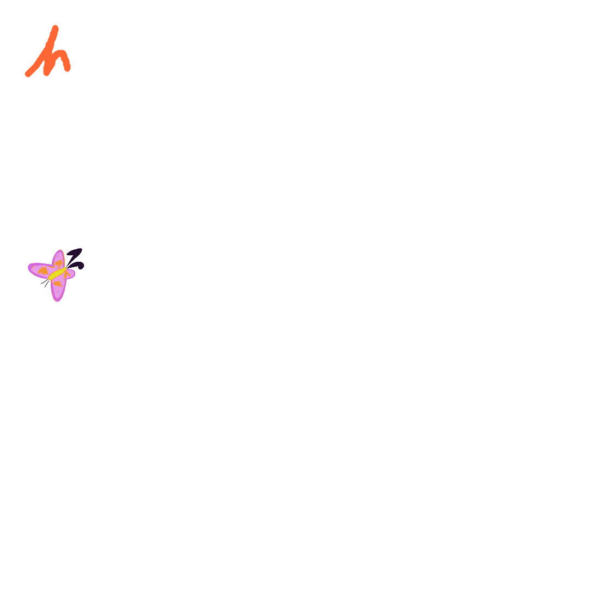

## The Challenge and Solution

I created a flying butterfly gif using frame-by-frame animation techniques in Photoshope and Procreate. Then I decided I wanted to analyze the butterfly gif and try to resize it using Python. 
When I first attempted a resize, I encountered an unexpected issue. Here's what happened.

### The Problem

In my original "Gif_Keep_Flying.gif", the butterfly appeared to be flying smoothly. This effect was achieved by showing only one butterfly in one position at any given time. Each subsequent frame would show what looked like the same butterfly, but in a slightly different position, creating the illusion of movement.




### The First Resize 

However, when I initially resized the GIF, the result was quite different. Instead of seeing a single butterfly moving across the frame, I saw all the positions of the flying butterfly displayed simultaneously. This completely ruined the flying effect, as the butterfly no longer appeared to move - instead, it looked like multiple static butterflies were present on the screen at once.


### Understanding the Issue

I realized that the resizing process was somehow losing the frame disposal information. In the original GIF, each frame was likely set to clear the previous frame before drawing the next one. This crucial detail was being lost during resizing, causing all frames to accumulate and display at once.

### The Solution

To fix this, we needed a resizing method that would preserve the frame disposal method of the original GIF. Here's the key part of the script that addresses this issue:

```python
if img.disposal_method == 2:  # 2 means clear to background
    frame = frame.convert("RGBA")
    if "transparency" in img.info:
        frame.putalpha(frame.getchannel("A").point(lambda x: 0 if x == img.info["transparency"] else x))
```

This code ensures that for frames with a disposal method of 2 (which means "clear to background"), we handle the transparency correctly. By doing this for each frame, we maintain the original behavior where only one butterfly position is visible at a time.

## Resizing Results

The GIF resizing process maintained the smooth animation of the flying butterfly. It also in significantly reducing the file size. Here are the results:

- Original GIF size: 554.32 KB
- Resized GIF size: 113.34 KB

This represents a size reduction of approximately 79.55%, while preserving the essential animation quality.

### Visual Comparison

To better illustrate the results, here is the properly resized GIF:


As you can see, the resized GIF maintains the smooth flying effect of the butterfly while being significantly smaller in file size. This makes it more suitable for web applications, faster loading times, and reduced storage requirements.

### Key Achievements

1. **Preserved Animation Quality**: The flying effect of the butterfly remains smooth and intact in the resized version.
2. **Significant Size Reduction**: Achieved a 79.55% reduction in file size.
3. **Maintained Transparency**: The background transparency of the GIF was preserved during resizing.
4. **Improved Usability**: The smaller file size makes the GIF more versatile for various digital platforms while retaining its visual appeal.

### The Result
The resized GIF behaved just like the original. I could see the butterfly flying again.

## Try It Out!

Want to resize your own GIFs while preserving smooth animations? You can use the same script I developed for this project!

To get started:

1. Check out the [GIF Resizer Script](gif_resizer.py) in this repository.
2. Download the script to your local machine.
3. Make sure you have Python and Pillow installed (`pip install Pillow`).
4. Place your GIF in the same directory as the script.
5. Modify the script to use your GIF's filename and desired dimensions.
6. Run the script and see your resized GIF!
7. Read more detailed [instructions here](gif_resizer_instructions.md).

Feel free to experiment with different sizes and let me know how it works for your GIFs. If you encounter any issues or have suggestions for improvements, please open an issue in this repository.

Happy GIF resizing!


